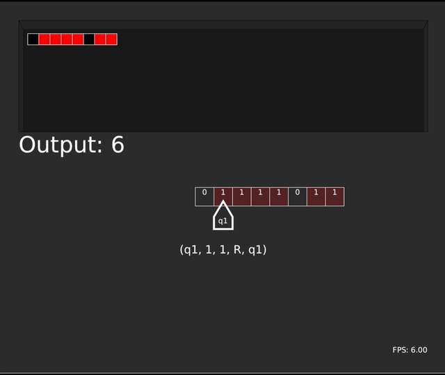

# TuringMachine
A [Turing machine](https://en.wikipedia.org/wiki/Turing_machine) interpreter made in Java using Processing libraries.

<br/>
_This is the [Example2.tm](https://github.com/margual56/TuringMachine/blob/f42250c67b4bccfd45451fed96c9bcbdbd805cdc/Examples/Example2.tm) program running in real time_

## Programming in Turing Machine code
Inside the [exmaples folder](https://github.com/margual56/TuringMachine/tree/master/Examples), there are 5 example programs of how to code a Turing Machine program. The extension of the files __has__ to be `.tm`.

Firstly, you define the initial state of the tape (example):
```Td
{q011101111};
```

After that (in this order), you define the final state:
```Td
#define F = {f};
```

And finally, you define all the states that you want. The syntax is the following: (state, oldValue, newValue, L/R/H (meaning "left/right/halt"), goToState);<br/><br/>
Example:
```Td
(q0, 1, 0, R, q1);
```

Comments can be written using `//`

So a fully-working program would look like this (from [Example1.tm](https://github.com/margual56/TuringMachine/blob/8517c6134f74cfb1042d1a34e34811b2b86143bd/Examples/Example1.tm)):
```Td
{q011101111};

#define F = {f};

(q0, 1, 0, R, q1);

(q1, 1, 1, R, q1);
(q1, 0, 0, R, q2);//1

(q2, 0, 1, L, q3);
(q2, 1, 1, R, q2);

(q3, 1, 0, L ,q4);

(q4, 1, 1, L, q4);
(q4, 0, 0, L, q5);//2

(q5, 1, 1, L, q5);
(q5, 0, 0, R, q0);

(q0, 0, 0, R, q6);//3

(q6, 0, 0, R, q6);
(q6, 1, 0, H, f);//4

(f, 0, 0, H, f);
(f, 1, 1, H, f);
```

# Use the interpreter
Go to the [releases page](https://github.com/margual56/TuringMachine/releases) and download the latest version. It is programmed in Java, so it is cross-platform.<br/>
When you execute it, it will prompt you to select the ".tm" file (the turing machine code) you want to execute. Select it and it will start running.
  * `spacebar` -> pause/resume (or restart if the execution has finished)
  * `right arrow` -> Advance just one instruction forward
  * `enter` -> Jump to the end of the execution
  * `r` -> Stop, load a new program and run it
  * `ESC` -> Exit cleanly
  * Currently, there is no way to speed up/down the execution whithout modifying the code, but it is possible.

# License
[GNU GPLv3](https://choosealicense.com/licenses/gpl-3.0/)
