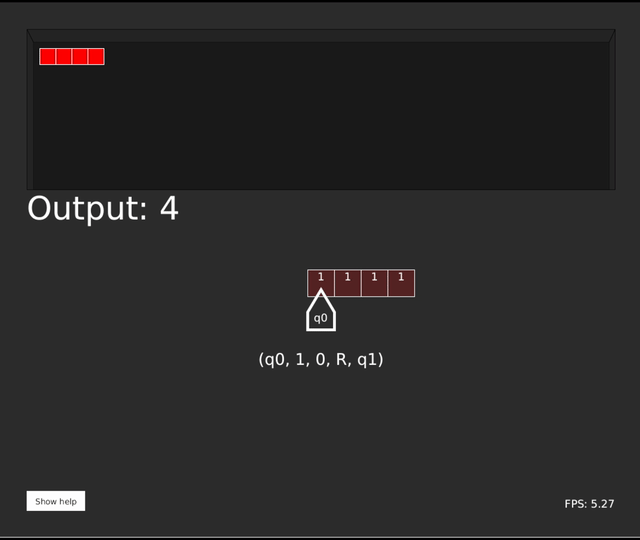

[](https://github.com/margual56/TuringMachine/actions/workflows/junit.yml)

# TuringMachine
A [Turing machine](https://en.wikipedia.org/wiki/Turing_machine) interpreter made in Java using Processing libraries.

<br/>
_This is the [Example2.tm](https://github.com/margual56/TuringMachine/blob/654b77f2f1725ba0030eee0c7b79adbcd719491d/Examples/Example2.tm) (which duplicates the input) running in real time_

### Downloads
* Download [the latest version](https://github.com/margual56/TuringMachine/releases)!
* Also, check out the extensions, which enable syntax highlighting, icons for the supported files and more:
    * The [Visual Studio Code extension](https://marketplace.visualstudio.com/items?itemName=MarcosGutirrezAlonso.turing-machine)
    * The [Code-OSS extension](https://marketplace.visualstudio.com/items?itemName=MarcosGutirrezAlonso.turing-machine)
    * The [repository of the extension](https://github.com/margual56/vscode-turing-machine)

## Using the Turing Machine in the CLI
(From [version 3](https://github.com/margual56/TuringMachine/releases?q=v3) onwards)

```
Usage: java -jar TuringMachine.jar [options]
				
	A simple Turing Machine simulator with a GUI. It uses the syntax we use at class in Computability (EPI Gijón).
				
Optional arguments:
	(none)			Run the program normally (GUI mode)
	-h, --help			Show this help message and exit
	--headless FILE [-v]	Run in headless mode (print the result and exit, no GUI). Write `-v` to get the verbose output.
	-e, --example		Print an example program and exit
					
Note:
	You can only provide one argument at a time. If more than one is provided, just the first one is going to be taken into account.
```


## Programming in Turing Machine code
Inside the [examples folder](https://github.com/margual56/TuringMachine/tree/master/Examples), there are 5 example programs of how to code a Turing Machine program. The extension of the files __has__ to be `.tm`.

Firstly, you define the initial state of the tape (example):
```Td
{q011101111};
```

After that (in this order), you define the final state:
```Td
#define F = {f};
```

And finally, you define all the states that you want. The syntax is the following: (state, oldValue, newValue, L/R/H (meaning "left/right/halt"), goToState);<br/><br/>
Example:
```Td
(q0, 1, 0, R, q1);
```

Comments can be written using `//`

So a fully-working program would look like this (from [Example1.tm](https://github.com/margual56/TuringMachine/blob/8517c6134f74cfb1042d1a34e34811b2b86143bd/Examples/Example1.tm), it adds the two input numbers):
```Td
{q011101111};

#define F = {f};

(q0, 1, 0, R, q1);

(q1, 1, 1, R, q1);
(q1, 0, 0, R, q2);//1

(q2, 0, 1, L, q3);
(q2, 1, 1, R, q2);

(q3, 1, 1, L ,q4);

(q4, 1, 1, L, q4);
(q4, 0, 0, L, q5);//2

(q5, 1, 1, L, q5);
(q5, 0, 0, R, q0);

(q0, 0, 0, R, q6);//3

(q6, 0, 0, R, q6);
(q6, 1, 0, H, f);//4

(f, 0, 0, H, f);
(f, 1, 1, H, f);
```

# Use the interpreter
Go to the [releases page](https://github.com/margual56/TuringMachine/releases) and download the latest version. It is programmed in Java, so it is cross-platform.<br/>
When you execute it, it will prompt you to select the ".tm" file (the turing machine code) you want to execute. Select it and it will start running.
  * `spacebar` -> pause/resume (or restart if the execution has finished)
  * `right arrow` -> Advance just one instruction forward
  * `enter` -> Jump to the end of the execution
  * `r` -> Stop, load a new program and run it
  * `ESC` -> Exit cleanly
  * `+` -> Increase speed
  * `-` -> Decrease speed
  * `=` -> Restore initial speed

# License
[GNU GPLv3](https://choosealicense.com/licenses/gpl-3.0/)
